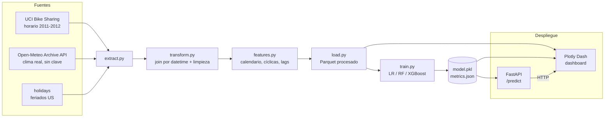

# Arquitectura de la solución

## Flujo de datos (ETL → ML → servicios)

## Componentes

| Capa | Módulo | Responsabilidad |
|---|---|---|
| **Extracción** | `bikeshare/etl/extract.py` | Descarga UCI (`ucimlrepo`), clima (Open-Meteo), feriados (`holidays`). |
| **Transformación** | `bikeshare/etl/transform.py` | Construye `datetime`, une las 3 fuentes, limpia e interpola. |
| **Features** | `bikeshare/features.py` | Calendario, codificación cíclica, lags/medias móviles sin fuga temporal. |
| **Carga** | `bikeshare/etl/load.py` | Persiste el dataset final en Parquet. |
| **Modelado** | `bikeshare/models/` | Split temporal, comparación de modelos, artefactos y métricas. |
| **API** | `bikeshare/api/main.py` | Sirve el modelo (FastAPI): `/health`, `/model/info`, `/predict`. |
| **Dashboard** | `bikeshare/dashboard/app.py` | Visualización interactiva (Plotly Dash) + panel de predicción. |
| **Orquestación** | Docker + docker-compose | API (8000) y dashboard (8050) en una imagen común. |
| **CI/CD** | GitHub Actions | Lint (ruff), tests (pytest) y build de la imagen. |

## Decisiones de diseño

- **Integración multi-fuente real.** El dataset UCI ya trae clima *normalizado*, pero se enriquece con
  **Open-Meteo** para incorporar variables que UCI no tiene (p. ej. **precipitación real**) y demostrar
  consumo de una **API** en el ETL. Los **feriados** añaden contexto de calendario.

- **Split temporal (sin barajar).** Al ser una **serie de tiempo**, mezclar filas filtraría información del
  futuro al pasado. El test es el último 20% cronológico y la validación usa `TimeSeriesSplit`.

- **Variables autoregresivas correctas.** Los lags (`lag_1h`, `lag_24h`) y las medias móviles se calculan
  sobre una **rejilla horaria completa**, de modo que un hueco en los datos no se confunda con una hora
  contigua. Esto evita *data leakage* y hace que las features sean fieles al tiempo real.

- **XGBoost como modelo final.** Supera a Random Forest y a la regresión lineal en todas las métricas
  (R² 0.961 vs 0.947 vs 0.831), capturando bien las no linealidades entre hora, clima y demanda.

- **API + dashboard desacoplados.** El dashboard consume la API por HTTP (`API_URL`), reflejando una
  arquitectura de microservicios; si la API no está disponible, cae a predicción con el modelo local.

- **Reproducibilidad.** Todo se regenera con `uv sync && make etl && make train`. Se versiona el dataset
  procesado y `model.pkl` para que Docker y CI funcionen sin depender de la red.
